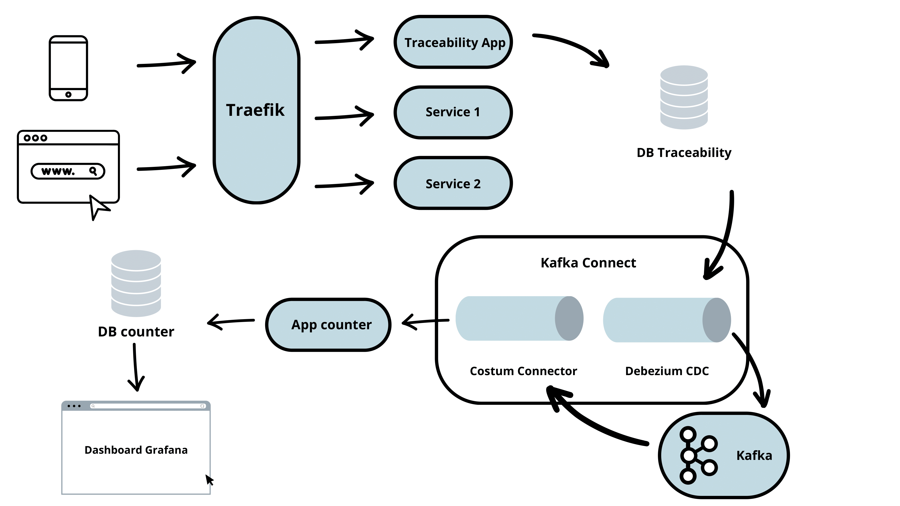
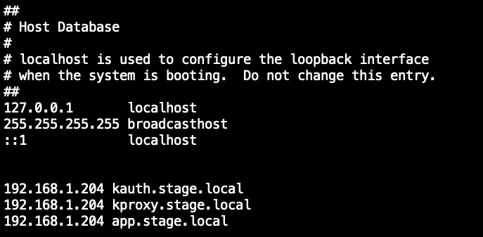
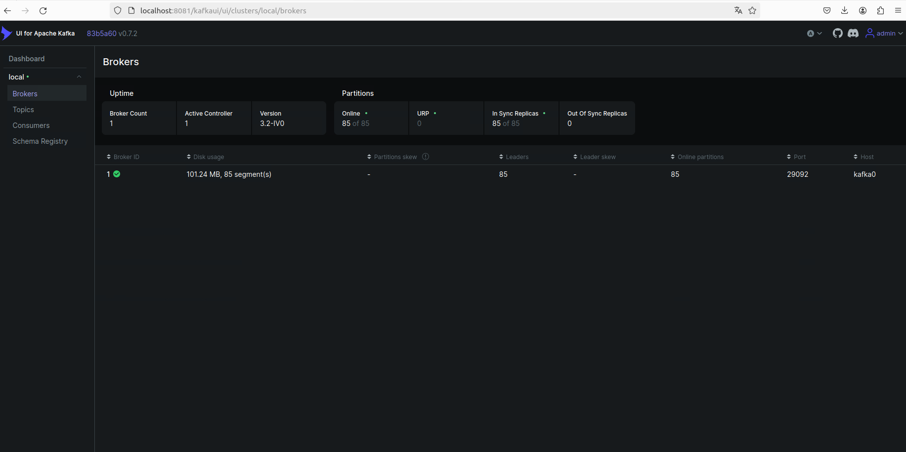
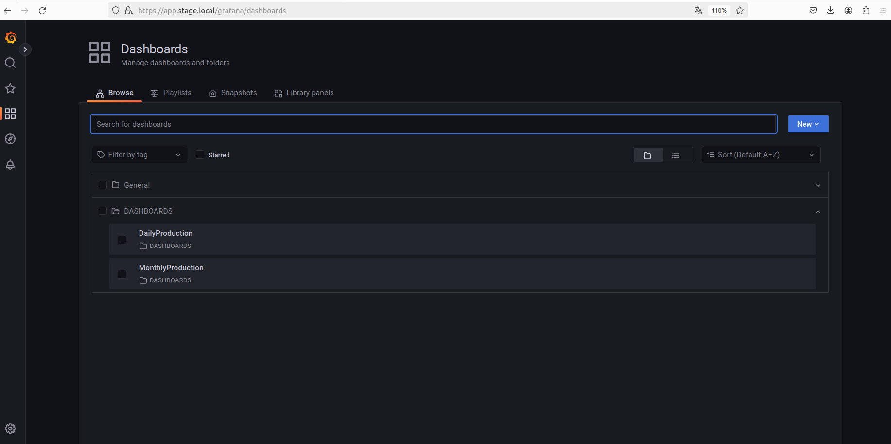
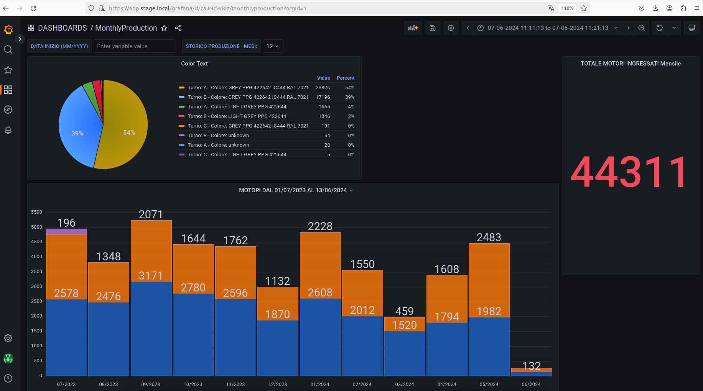

# EDM-Kafka_Integration

## Descrizione
Il progetto ha come obiettivo principale il disaccoppiamento di due applicazioni: una sorgente che produce dati e una consumatrice che utilizza tali dati per aggiornare dei contatori visualizzati su dashboard di Grafana. 
Si vuole ottenere una comunicazione indipendete tra le due in modo tale che un eventuale guasto di una delle due, non comprometta l'intero sistema, aumentando così la sua resilienza.

Per risolvere questo problema, è stato implementato un sistema basato su Apache Kafka e Kafka Connect. I dati prodotti dall'applicazione sorgente vengono ora trasmessi a Kafka utilizzando un connettore open-source, Debezium, che facilita il Change Data Capture (CDC). Questo consente alla sorgente di continuare a produrre dati indipendentemente dallo stato dell'applicazione consumatrice.
L'elemento centrale del progetto è la realizzazione di un plugin personalizzato, un connettore sink per Kafka Connect, che legge i dati da Kafka, li elabora e invia le richieste all'applicazione consumatrice per aggioranre dei contatori. Questo connettore è stato progettato per soddisfare le esigenze specifiche del sistema, garantendo che i dati siano processati correttamente.

Grazie a questa architettura, se l'applicazione consumatrice si interrompe, l'applicazione sorgente può continuare a generare dati che vengono inviati a Kafka. Quando l'applicazione consumatrice tornerà operativa, potrà riprendere a leggere i dati da Kafka senza perdita di informazioni. Allo stesso modo, se l'applicazione sorgente si interrompe, l'applicazione consumatrice continuerà a leggere i dati già presenti in Kafka e riceverà i nuovi dati non appena la sorgente tornerà attiva. 

Questo approccio ha significativamente aumentato la robustezza del sistema, assicurando che i dati siano sempre disponibili per il consumatore finale.

Il progetto è composto dalle seguenti directory:
1. **AppCompose**: sono presenti i progetti di deploy basati su Docker Compose.
2. **AppProjects**: è presente il codice sorgente del connettore sink, creato per il caso d'uso specifico, per Kafka Connect.


## Indice 
1. [Descrizione](#descrizione)
2. [Componenti](#componenti)
3. [Prerequisiti](#prerequisiti)
4. [Installazione](#installazione)
5. [Utilizzo](#utilizzo)
6. [Avvio dei connettori](#avvio-dei-connettori)
7. [Visualizzazione dei dati](#visualizzazione-dei-dati)
8. [Verifica del lavoro](#verifica-del-lavoro)


## Componenti

Le componenti utilizzate sono:
1. [**Traefik**](https://traefik.io/traefik/): reverse proxy open-source utilizzato per l'instradamento delle richieste client verso i microservizi contenuti nel AppCompose.
2. [**Keycloak**](https://github.com/keycloak/keycloak): un prodotto open-source per consentire il Single Sign-On (SSO) per la gestione dele identità e degli accessi.
3. [**MySql**](#.): Database utilizzato sia dall'applicazione sorgente che dall'applicazione contatori.
4. [**Grafana**](https://grafana.com/): strumento per la visualizzazione dei dati presenti nell'app contatori, tramite delle dashboards.
5. [**Apache Kafka**](https://kafka.apache.org/): piattaforma open-source utilizzata per lo streaming di eventi.
6. [**Apache Kafka Connect**](https://docs.confluent.io/platform/current/connect/index.html): è un framework di sviluppo per l'integrazione dei dati tra Apache Kafka ed altri sistemi. È progettato per facilitare lo spostamento dei dati tra Kafka ed altri sistemi come database. Ci sono due tipi di connettori: quelli che leggono i dati da un sistema esterno e li trasmettono in Kafka, chiamati 'Source', e quellli progettati per spostare i dati da Kafka ad una destinazione come un database, nominati 'Sink'. Kafka Connect fornisce una vasta gamma di connettori già pronti, che possono essere utilizzati,ma offre, agli sviluppatori, anche la possibilità di realizzare i propri connettori.

	Per questo progetto, i connettori utilizzati sono: 
	* [***Source - Debezium MySql Connector***](https://debezium.io/) : si collega al DB dell'app produttrice e consente il CDC (change-data-capture). 
	Il CDC è un meccanismo per poter acquisire le modifiche da un database di origine e consegnarle ad un altro sistema. Consente di acquisire lo stato del database e di tener traccia delle modifiche che vengono apportate.
	Debezium è una piattaforma open-source che offre diversi connettori, tra cui quello per MySql utilizzato nel caso specifico, che consentono il CDC basato su log. 
	
		Il connettore utilizza duqnue il registro delle transizioni binarie del database per catturare le operazioni effettuate, quali insert, update o delete. 
	
	
	* [***Sink - Custom Connector***](#.) : il custom connector, come intuibile dal nome, è un connettore personalizzato, realizzato per il caso d'uso specifico. 
	Il connettore personalizzato è progettato per leggere dati dai topic Kafka, trasformarli e inviare richieste all'applicazione contatori. Il flusso di lavoro dettagliato del connettore è il seguente:

		- ***Configurazione e Avvio*** :

			Il connettore viene avviato con una configurazione specifica che include i dettagli dell'SSO (Single Sign-On) URL, nome del Reame, client ID, client secret e l'URL dell'applicazione contatori, in questo caso.
			Vengono anche specificati i nomi dei topic di Kafka a cui dovrà iscriversi per poter consumare i dati.
			
		
		- ***Autenticazione*** :

			Prima di poter inviare le richieste all'applicazione contatori, il connettore deve ottenere un token JWT (JSON Web Token) per autenticarsi.
			La classe ConfidentialAuthService gestisce il processo di autenticazione, includendo il recupero e la verifica del token JWT.
			
		- ***Elaborazione dei Dati*** :

			Una volta avviato, il connettore utilizza la classe CustomSinkConnectorTask per leggere i dati dai topic Kafka ai quali è iscritto. Successivamente i dati vengono trasformati utilizzando la classe TraceabilityJsonItem, che utilizza la libreria Gson per estrarre le informazioni necessarie dal JSON.
			Questi dati trasformati vengono poi elaborati per creare e/o incrementare dei contatori che verranno poi inviati all'app counter. 
		
		- ***Invio delle Richieste*** : 

			La classe Counter è responsabile dell'invio delle richieste all'applicazione contatori. Le richieste includono le operazioni specifiche che devono essere eseguite, come l'aggiornamento dei contatori.
			Le richieste vengono inviate utilizzando il token JWT ottenuto precedentemente per garantire che il connettore abbia i permessi necessari.
	
		

7. [**Schema-registry**](#.): gestisce la distribuzione di schemi al produttore e al consumatore memorizzando una copia dello schema nella sua cache locale.
8. [**Kafka-UI**](https://github.com/provectus/kafka-ui): strumento open-source che rende osservabili i flussi di dati in Kafka.



## Prerequisiti
Per il progetto sono necessari i seguenti strumenti: 
* Docker
* Docker Compose
* 7zip
* jq 


Per l'installazione di Docker e Docker Compose, seguire il link alla [documentazione ufficiale di Docker](https://docs.docker.com/get-docker/).
	
Per installare 7zip seguire [questo link](https://www.7-zip.org/download.html).

Per installare jq, seguire [questo link](https://jqlang.github.io/jq/download/) ed installare la versione adatta al proprio sistema.

### Specifiche 
Il progetto è stato realizzato utilizzando:
- Macchina virtuale Ubuntu per lo sviluppo;
- Docker, con versione: 
	- 26.1.3, build b72abbb
- Docker Compose, con versione:
	- v2.27.0
- 7zip per comprimere le immagini necessarie. 

Pertanto, è consigliato utilizzare una macchina Ubuntu per eseguire il progetto.

# Installazione
Per l'installazione del progetto, clonare il repository tramite il comando:
```sh
git clone https://github.com/tarquinio00/EDM-Kafka_Integration.git
```

## Configurazione file hosts
Dopo aver clonato il progetto, bisognerà fornire un'interfaccia per i servizi che verranno avviati. Per fare ciò, bisognerà manipolare il file hosts della propria macchina.
```sh
sudo nano /etc/hosts
```
Successivamente, aggiornare il file, assegnando un'interfaccia di riferimento per i servizi di Keycloak, Traefik e per l'app contatori, che deve essere diversa dal localhost:
```sh
your_ip kauth.stage.local
your_ip kproxy.stage.local
your_ip app.stage.local
```
**Esempio di configurazione**



## Inizializzazione app contatori
Successivamente, bisognerà inizializzare l'App Contatori caricando le immagini Docker per l'app sorgente e Keycloack. 
Le loro immagini sono presenti in: 
- EDM-Kafka_Integration
	- AppCompose
	
Prima di poter caricare le immagini è necessario estrarle. Per farlo bisogna avere 7zip installato ed eseguire i seguenti comandi:

### Estrazione immagine app Counter
```sh
cd EDM-Kafka_Integration/AppCompose
7z e counterImage.7z.001
```
Anche se si sta specificano solo una delle partizioni, 7zip cercherà le altre ed estrarrà correttamente l'immagine.

### Estrazione immagine Keycloak
```sh
cd EDM-Kafka_Integration/AppCompose
7z e keycloakImage.7z.001
```

Una volta estratte sarà possibile caricarle.
Per farlo, bisognerà eseguire il file di inizializzaizone: 
```sh
cd EDM-Kafka_Integration/AppCompose
./initialize_app.sh
```

### Estrazione Database Source
Oltre alle immagini, bisogna estrarre anche lo script sql per il database source.
```sh
cd EDM-Kafka_Integration/AppCompose
cd app.docker/docker/builds/mysql
7z e dbSource.7z.001
```


## Avvio dei servizi
Una volta caricate le immagini, bisognerà avviare, nel seguente ordine, il reverse proxy, keycloak, l'app contatori e Kafka. 
Per l'avvio automatizzo sono stati implementati degli script: 
* **dc_up.sh** - aiuta a creare le network necessarie, le immagini e crea e avvia i container. I container provengono dai servizi specificati nel file di configurazione
* **dc_rm.sh** - arresta e rimuove i container. 
* **dc_stop.sh** - arresta i container senza rimuoverli. 

### Start Traefix Proxy
```sh
cd EDM-Kafka_Integration/AppCompose
cd kproxy.docker
./dc_up.sh 
```

### Start Keycloack
```sh
cd EDM-Kafka_Integration/AppCompose
cd kauth.docker
./dc_up.sh 
```

### Start app counter
```sh
cd EDM-Kafka_Integration/AppCompose
cd app.docker
./dc_up.sh 
```

### Start Kafka 
```sh
cd EDM-Kafka_Integration/AppCompose
cd kafka.docker
./dc_up.sh 
```


A questo punto, tutte le immagini sono state costruire e tutti i container necessari sono in esecuzione. 


# Utilizzo
## Avvio dei connettori
Una volta avviati tutti i container il servizio Kafka Connect è pronto per ricevere i dettagli utili per l'avvio dei connettori.
Kafka Connect mette a disposizione la propria API per fare ciò.
Per avviare i connettori sono presenti degli script che basterà eseguire dalla shell.

### Start Debeziuim Connector to CDC from Source DB
```sh
cd EDM-Kafka_Integration/AppCompose
cd kafka.docker
./runDbzConnector.sh
```
Debezium si collega al DB dell'app sorgente e monitora il log delle transazioni per catturare tutte le operazioni che vengono effettuate. In base alla tabella di provenienza di tali informazioni, crea un corrispondente topic in Kafka dove memorizzare questi dati. 

### Start Custom Connector to consume data
```sh
cd EDM-Kafka_Integration/AppCompose
cd kafka.docker
./runCustomConnector.sh
```
Il connettore personalizzato si iscrive ai topic specificati nel file di configurazione e consuma i dati presenti. 


## Esempio di Flusso di Dati


Il produttore genera dei dati che vengono memorizzati nel DB dell'applicazione produttrice. Il connettore Debezium, in ascolto sul log del DB sorgente, riconosce l'evento e memorizza il record in Kafka nel giusto Topic. 
Dall'altro lato, il connettore personalizzato riceve i dati da Kafka, li elabora e li invia meidante richiesta HTTP all'app contatori per aggiornare o inserire nuovi contatori.


## Visualizzazione dei dati
Per visualizzare i dati sono presenti due componenti: Kafkaui e Grafana.
Kafkaui consente la visualizzazione dei flussi di dati in Kafka.
Grafana viene utilizzato per la visualizzazione dei dati dell'applicazione consumatrice. Comunica con il DB dell'app contatori e mostra i dati tramite delle dashboards.

### Kakfa-UI
Accedere a Kafka-UI tramite:
```sh
	localhost:8081/kafkaui
	User: admin 
	Password: pass
```
Una volta effettuato l'accesso si potrà amministrare il cluster Kafka.


### Grafana
Accedere a Grafana tramite:
```sh
	app.stage.local/grafana
	User: lan
	Pass: lan2000
```
Una volta effettuato l'accesso è possibile utilizzare una delle due dashboard presenti per visualizzare i dati o creare di nuove personalizzate. 




## Verifica del lavoro
Grazie a degli script presenti in
```sh
	cd AppCompose/app.docker/
```
è possibile verificare che i connettori svolgano il loro lavoro correttamente. 
Gli script da dover eseguire, nel seguente ordine, sono:
1. ```sh
	./insertNewRecord.sh 
	```
	che va ad aggiungere un record, contenente due items, al database dell'applicazione produttrice.  
	Una volta terminata l'operazione, il connettore Debezium riconosce la modifica e la propaga a Kafka in tempo reale. A questo punto, il Custom Connector legge gli eventi su Kafka, esegue tutte le trasformazioni necessarie ed invia le richieste per inserire/aggiornare i contatori all'app consumatirce. 
	Collegandosi a Grafana, sarà possibile visualizzare, tramite la MonthlyDashboard, l'incremento del numero totale dei motori ingressati, ad esempio.

2.  ```sh
	./deleteRecord.sh 
	```
	che va ad eliminare, nel database sorgente, il record inserito precedentemente. Esattamente come prima, anche questo evento sarà trasmesso in tempo reale, fino ad arrivare all'app consumatrice che andrà a decrementare/eliminare i contatori e, tramite Grafana, sarà possibile visualizzare l'aggiornamento del numero dei motori ingressati.
